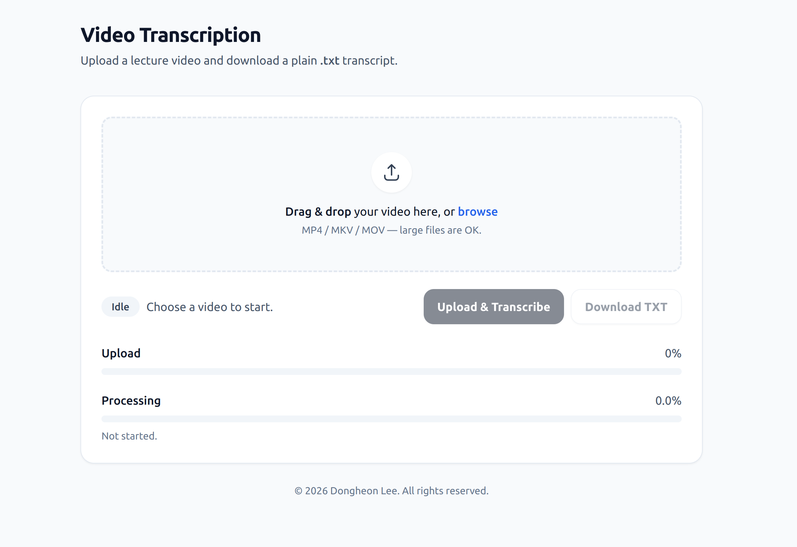
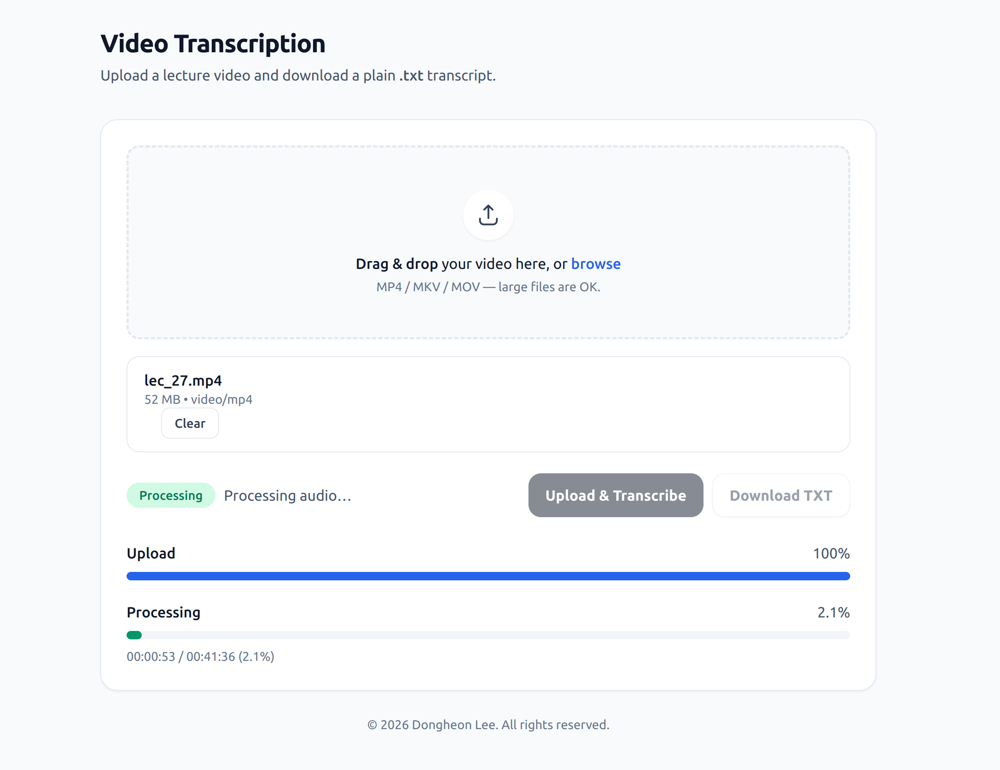
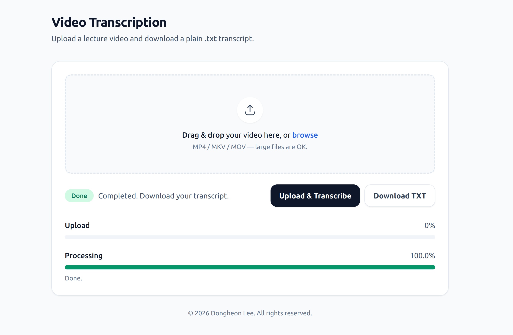

# whisper-web-transcriber

A web-based video/audio transcription service powered by **OpenAI Whisper**, designed to run on a **local GPU server**.  
It supports large file uploads, real-time progress tracking via **SSE**, job queueing, and transcript download through a simple web UI.

This project is optimized for personal or small-team use cases such as lecture transcription, research notes, and offline processing on local machines (e.g., desktop GPU servers or Jetson devices).

---

## 📸 Demo

### Initial Page


### Processing Page


### Finished Page


---

## ✨ Features

- 🎙️ **High-quality transcription** using OpenAI Whisper (GPU-accelerated)
- 📁 **Large video/audio file upload** via browser
- 📊 **Real-time progress updates** (Server-Sent Events, SSE)
- 🧵 **Job queueing** (sequential processing, configurable queue length)
- 🔁 **Refresh-safe UI** (job state restored after page reload)
- ⏱️ **Automatic cleanup** (jobs deleted after configurable grace period)
- 📄 **Direct transcript download** (`.txt`)
- 🖥️ **Simple single-page web UI** (HTML + Tailwind)

---

## 🧠 Architecture Overview

```
Browser
├─ File upload (XHR)
├─ Progress stream (SSE)
└─ Download transcript
  ↓
FastAPI (Python)
├─ Upload endpoint
├─ SSE progress endpoint
├─ Job queue & status
└─ Download endpoint
  ↓
Wisper (CUDA)
└─ GPU-accelerated transcription
```

---

## 🚀 Getting Started

### 1️⃣ Requirements

- Ubuntu 22.04 (tested)
- NVIDIA GPU + CUDA
- Python 3.9+
- `ffmpeg`
- OpenAI Whisper (CLI)

---

### 2️⃣ Install Dependencies

```bash
sudo apt update
sudo apt install -y ffmpeg
```

Create and activate a Python environment (example with conda):

```bash
conda create -n whisper python=3.10
conda activate whisper
pip install -U openai-whisper fastapi uvicorn python-multipart
```

Verify Whisper works:

```bash
whisper --help
```

---

### 3️⃣ Run the Server

```bash
uvicorn app:app --host 0.0.0.0 --port 8000
```

Then open your browser:

```
http://localhost:8000
```

---

## 🖥️ Web UI Workflow

1. Select or drag & drop a video/audio file
2. Upload the file
3. Monitor progress in real time
4. Download the generated transcript (`.txt`)

If the page is refreshed during processing, the UI automatically reconnects to the running job.

---

## 🧵 Job Queue

- Jobs are processed **sequentially**
- Queue length is configurable (default: 10)
- Users see:
  - Busy/queued state
  - Number of jobs ahead in the queue

---

## 🧹 Cleanup Policy

- Completed jobs remain available for **10 minutes** after transcription
- After the grace period:
  - Job directory is deleted
  - Job metadata is removed from memory

This prevents disk space exhaustion while allowing safe re-downloads.

---

## 🌐 Remote Access

This project is designed to run on local GPU machines.

Recommended options for remote access:

- **Tailscale** (secure private access, no port forwarding)
- **ngrok** (temporary public URLs for testing)

---

## 📁 Project Structure

```
whisper-web-transcriber/
├── app.py              # FastAPI backend
├── jobs/               # Per-job working directories (gitignored)
├── static/
│   └── index.html      # Web UI
├── run.sh              # Server launch script
├── whisper_english.sh  # Whisper execution wrapper
└── README.md
```

---

## ⚠️ Notes

- This project is intended for **personal or small-scale use**
- No authentication is enabled by default
- **Do not expose publicly without access control**

---

## 🔮 Future Improvements

- [ ] Model selection (small / medium / large)
- [ ] Transcript preview in the browser
- [ ] Multiple language support
- [ ] Docker / Jetson-specific deployment guide

